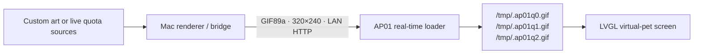

<div align="center">
  

  # CUKTECH AP01 Screen Kit

  **Make the detachable AP01 display yours — custom visuals, live Claude/Codex quotas, and LAN refreshes.**

  [](#quick-start)
  [](#compatibility)
  [](#screen-contract)
  [](LICENSE)

  [English](README.md) · [简体中文](README.zh-CN.md) · [Visual Tutorial](docs/xiaohongshu-tutorial.zh-CN.md) · [Skill](#codex-skill) · [Quick Start](#quick-start)
</div>

---

## What is this?

CUKTECH AP01 Screen Kit is a practical toolkit for the detachable display used
by the CUKTECH 10 charging station (`njcuk.enstor.ap01`). It provides a clean
workflow for:

- turning any image into a lightweight AP01-safe animated GIF;
- designing a high-legibility 320×240 status screen;
- rendering live quota dashboards from signed-in Claude Desktop and Codex;
- serving updates from a Mac over local Wi-Fi;
- installing the one-time AP01 `1.0.2_0031` real-time loader;
- changing content later without another firmware install.

The included quota dashboard is only a starting point. Replace it with artwork,
calendar, weather, energy telemetry, build status, Home Assistant metrics, or
any screen you want.

## Highlights

| Custom screen | Live quota dashboard | Lightweight runtime |
| --- | --- | --- |
| Convert artwork to a verified 320×240 GIF89a asset. | Claude 5-hour / week / Fable 5 and Codex 5-hour / week. | Two slow GIF frames, typically under 90 KB. |
| `contain`, `cover`, and `stretch` layouts. | Dark OLED-oriented UI, provider icons, reset clocks, Chinese labels. | AP01 stores updates in RAM-backed `/tmp`, not its resource partition. |

## Architecture



The first firmware installation adds the loader. Every later screen refresh is
fetched over Wi-Fi and rotated through RAM-backed files.

## Quick start

### 1. Create a local environment

```bash
git clone https://github.com/wqytommy666/cuktech-ap01-screen-kit.git
cd cuktech-ap01-screen-kit
python3 -m venv .venv
.venv/bin/python -m pip install -r requirements.txt
```

### 2. Make a custom screen from any image

```bash
.venv/bin/python ap01_prepare_screen.py ./my-artwork.png artifacts/screen.gif \
  --fit contain --background '#01040B'
.venv/bin/python ap01_screen_bridge.py artifacts/screen.gif --port 8765
```

The converter outputs a 320×240, two-frame GIF89a. Replace
`artifacts/screen.gif` atomically whenever you want new content; the AP01 will
retrieve it on its next refresh.

### 3. Render a Claude + Codex dashboard

Sign in to Claude Desktop and Codex on the Mac running the bridge, then run:

```bash
.venv/bin/python quota_dashboard.py
.venv/bin/python -u ap01_wifi_bridge.py --bind 0.0.0.0 --port 8765 --interval 300
```

Open `artifacts/quota-dashboard@2x.png` to inspect the design preview. The
bridge exposes:

```text
http://MAC_LAN_IP:8765/screen.gif
http://MAC_LAN_IP:8765/api/v1/quota
http://MAC_LAN_IP:8765/health
```

## First-time real-time firmware setup

The built-in binary patch targets **only** AP01 model `njcuk.enstor.ap01` on
firmware **`1.0.2_0031`**. Keep the Mac and AP01 on the same non-isolated LAN
and reserve the Mac's DHCP address before building the URL.

```bash
# Confirm and download the matching stock image through the signed-in Mi Home account.
.venv/bin/python mi_cloud.py firmware
.venv/bin/python mi_cloud.py download

# Build a fallback screen image and inject the local HTTP loader.
.venv/bin/python ap01_custom_ota.py artifacts/screen.gif \
  --firmware artifacts/ap01-1.0.2_0031.bin \
  --output artifacts/ap01-1.0.2_0031-screen-compat.bin

.venv/bin/python ap01_realtime_patch.py \
  --input artifacts/ap01-1.0.2_0031-screen-compat.bin \
  --output artifacts/ap01-1.0.2_0031-screen-realtime.bin \
  --build-dir artifacts/realtime-build \
  --url http://MAC_LAN_IP:8765/screen.gif \
  --refresh-seconds 300

# Validate transport, then install the exact prebuilt image.
.venv/bin/python ap01_install_firmware.py \
  artifacts/ap01-1.0.2_0031-screen-realtime.bin --download-only
.venv/bin/python ap01_install_firmware.py \
  artifacts/ap01-1.0.2_0031-screen-realtime.bin --install
```

Start the bridge before the final installation. A bridge log such as
`AP01_IP "GET /screen.gif" 200` confirms end-to-end operation.

### Xiaomi FDS upload prerequisite

The AP01 itself has no server-side FDS upload configuration. Passing the AP01
DID/model to `/home/genpresignedurl` therefore returns `code=-6` (`invalid
config for fds`). In the original transport, these are two different device
identities:

- an FDS-enabled `lumi.gateway.*` or `xiaomi.gateway.*` identity obtains the
  signed upload URL;
- the AP01 DID receives the later `miIO.ota` download command.

There is no AP01 bucket, model alias, or hard-coded object name to enter. If
the AP01 owner's account has no FDS-enabled gateway, a trusted gateway account
can upload the **exact same BIN** and pass the short-lived signed URL back.

On the uploader's Mac/account:

```bash
.venv/bin/python ap01_install_firmware.py \
  artifacts/screen-realtime.bin \
  --upload-only --url-output /tmp/ap01-ota-url.txt
```

If automatic discovery is ambiguous, add a real gateway identity owned by
that account: `--fds-did DID --fds-model lumi.gateway.MODEL`.

On the AP01 owner's Mac/account, immediately validate download without
installing:

```bash
.venv/bin/python ap01_install_firmware.py \
  artifacts/screen-realtime.bin \
  --download-only --ota-url-file /path/to/ap01-ota-url.txt --timeout 360
```

The signed URL is transferable, but temporary. Both sides must use the same
BIN bytes; do not rebuild between upload and download validation.

For an agent-ready Chinese runbook with diagnostics and completion criteria,
see [AP01 FDS solution without a local gateway](docs/AP01_FDS_NO_GATEWAY_SOLUTION.zh-CN.md).

## Screen contract

| Requirement | Value |
| --- | --- |
| Physical display | 320×240 |
| Container | GIF89a |
| Animation | At least 2 frames; slow animation is preferred |
| Recommended size | ≤ 90 KB |
| Firmware slot limit | 221,445 bytes |
| Runtime loader limit | 256 KiB |
| Overlay reserve | Leave rows 0–39 clear to preserve the stock clock/date |

## Flash behavior

Firmware installation is a one-time Flash write. Normal content and quota
refreshes are different: the loader writes GIF slots, metadata, and its ACK
record only to these RAM-backed paths:

```text
/tmp/.ap01q0.gif
/tmp/.ap01q1.gif
/tmp/.ap01q2.gif
/tmp/.ap01q.meta
/tmp/.ap01q.ack
```

That means changing artwork or refreshing quotas does **not** repeatedly write
the AP01 firmware or resource partitions.

## Privacy

- Claude and Codex data is fetched from the accounts already signed in on the
  local Mac.
- Session credentials remain in memory.
- Rendered JSON contains quota values only.
- The repository excludes firmware images, Xiaomi account credentials, signed
  download URLs, device IDs, local IP addresses, and generated artifacts.

## Codex Skill

This repository includes a self-contained Codex skill:

```bash
cp -R skills/cuktech-ap01-screen-kit ~/.codex/skills/
```

Then use prompts such as:

```text
Use $cuktech-ap01-screen-kit to turn this image into an AP01 screen.
Use $cuktech-ap01-screen-kit to design and deploy a Claude/Codex quota dashboard.
Use $cuktech-ap01-screen-kit to diagnose why AP01 is not refreshing.
```

The skill contains the reusable project template, deterministic converters,
firmware workflow, network checks, and bilingual task guidance.

## Repository layout

```text
ap01_prepare_screen.py     Convert arbitrary images into AP01-safe GIFs
ap01_screen_bridge.py      Serve mutable artwork over LAN
quota_dashboard.py         Render live Claude + Codex quota UI
ap01_wifi_bridge.py        Refresh and serve the quota dashboard
ap01_realtime_patch.py     Build the 1.0.2_0031 RAM-backed loader
ap01_install_firmware.py   Deliver an already-built image through Xiaomi OTA
realtime_payload/          AP01 loader source
skills/                    Installable Codex skill
```

## Development

```bash
.venv/bin/python -m unittest -v test_quota_dashboard.py test_ap01_install_firmware.py
.venv/bin/python ap01_prepare_screen.py docs/images/quota-dashboard-preview.png /tmp/ap01.gif
```

See [CONTRIBUTING.md](CONTRIBUTING.md) for contribution conventions. The project
is released under the [MIT License](LICENSE).
