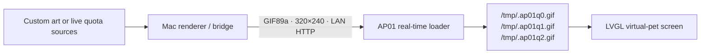

<div align="center">
  

  # CUKTECH Screen Controller

  **A macOS controller and agent-ready toolkit for the CUKTECH AP01 detachable display.**

  Custom images and GIFs · Live Claude/Codex quotas · Local Wi-Fi refresh · RAM-backed updates

  [](#advanced-and-manual-setup)
  [](#first-time-real-time-firmware-setup)
  [](#screen-contract)
  [](LICENSE)

  [Beginner guide](docs/BEGINNER_GUIDE.md) · [Install the macOS app](#method-1--install-the-macos-app) · [Use with a coding agent](#method-2--give-this-repository-to-a-coding-agent)

  [English](README.md) · [简体中文](README.zh-CN.md) · [Visual Tutorial](docs/xiaohongshu-tutorial.zh-CN.md) · [Skill](#coding-agent-skill)
</div>

---

## Choose how you want to use it

CUKTECH Screen Controller provides two ways to control the AP01 display.

> New to developer tools? Start with the
> [step-by-step beginner guide](docs/BEGINNER_GUIDE.md).

| | Method 1: macOS app | Method 2: coding agent |
| --- | --- | --- |
| Best for | Everyday use with a native UI | First-time setup, diagnostics and deep customization |
| Interface | CUKTECH Screen Controller for macOS | Claude Code, Codex, OpenCode, WorkBuddy or another terminal-capable agent |
| Custom images | Choose PNG, JPG or GIF and push | Convert, validate and deploy through repository tools |
| Quota dashboard | Claude and Codex live usage | Fully configurable renderer and data sources |
| First-time loader | BFNP preflight and OTA ticket handoff | Complete compatibility, build and installation workflow |
| Daily refresh | Wi-Fi update to AP01 RAM | Wi-Fi update to AP01 RAM |

## Method 1 — Install the macOS app

Download the latest **CUKTECH Screen Controller** package from
[GitHub Releases](https://github.com/wqytommy666/cuktech-screen-controller/releases/latest),
unzip it, then double-click **`Install CUKTECH Screen Controller.command`**.
The installer creates an isolated local runtime, installs the app in
`~/Applications`, and enables the login background service.

### Current macOS requirements

- macOS 14 or later, with no maximum-version cap;
- an Apple Silicon Mac for the current `arm64` build, including 2024, 2025,
  and 2026 models;
- macOS versions 24, 25, 26 and later satisfy the version check;
- Mac and AP01 on the same non-isolated Wi-Fi network;
- Claude Desktop and the official Codex app already signed in for quota mode;
- an internet connection during first install for the Python dependencies.

The app can show bridge status, switch between the quota dashboard and custom
artwork, preserve animated GIFs, select `contain` / `cover` / `stretch`, and
guide BFNP preflight plus temporary OTA ticket handoff.

<div align="center">
  
</div>

<div align="center">
  
</div>

> The app never silently installs firmware. Its **First deployment / OTA**
> window performs preflight, ticket handoff and download-only verification.
> A stock AP01 still needs the compatible one-time loader workflow below.

## Method 2 — Give this repository to a coding agent

Copy this repository URL into Claude Code, Codex, OpenCode, WorkBuddy, or
another coding agent that can read GitHub and run terminal commands:

```text
https://github.com/wqytommy666/cuktech-screen-controller
```

Suggested prompt:

```text
Use https://github.com/wqytommy666/cuktech-screen-controller as the source of
truth. Read AGENTS.md, README.md and
skills/cuktech-ap01-screen-kit/SKILL.md first.

I am not a programmer, so ask for one manual action at a time. I have a
CUKTECH AP01 detachable display. Run ./macos/diagnose.sh, then start with
read-only compatibility and network checks. Confirm its model, firmware version, Mac LAN address,
bridge health, and whether the real-time loader is already installed.

Then install the bridge, configure either the Claude/Codex quota dashboard or
my custom image, verify /health and an AP01 GET /screen.gif 200 request, and
enable automatic startup after macOS login. If the loader is missing, build
and validate the exact compatible image first and ask before installing it.
Normal screen refreshes must use the RAM-backed /tmp slots and must not
reinstall firmware.
```

Agents without native Codex Skill support can still read `SKILL.md` as a
complete operating guide.

The repository also includes `AGENTS.md`, `CLAUDE.md`, a read-only diagnostic,
and a one-command macOS setup:

```bash
./macos/diagnose.sh
./scripts/setup-macos.sh
```

## One-time installation and daily refreshes are different

- **One-time loader installation:** writes firmware Flash once and supports
  only model `njcuk.enstor.ap01` on firmware `1.0.2_0031`.
- **Normal image and quota refreshes:** rotate GIF files through
  `/tmp/.ap01q*.gif`, which is RAM-backed. They do not rewrite firmware or
  resource partitions.
- If the Mac goes offline, AP01 keeps its last successfully loaded screen and
  resumes refreshing when the bridge returns.

## What is this?

CUKTECH Screen Controller is a native macOS app and practical toolkit for the detachable display used
by the CUKTECH 10 charging station (`njcuk.enstor.ap01`). It provides a clean
workflow for:

- turning any image into a lightweight AP01-safe animated GIF;
- designing a high-legibility 320×240 status screen;
- rendering live quota dashboards from signed-in Claude Desktop and Codex;
- serving updates from a Mac over local Wi-Fi;
- installing the one-time AP01 `1.0.2_0031` real-time loader;
- changing content later without another firmware install.

The included quota dashboard is only a starting point. Replace it with artwork,
calendar, weather, energy telemetry, build status, Home Assistant metrics, or
any screen you want.

## Highlights

| Custom screen | Live quota dashboard | Lightweight runtime |
| --- | --- | --- |
| Convert artwork to a verified 320×240 GIF89a asset. | Claude 5-hour / week / Fable 5 and Codex 5-hour / week. | Bounded animation, typically under 90 KB. |
| `contain`, `cover`, and `stretch` layouts. | Dark OLED-oriented UI, provider icons, reset clocks, Chinese labels. | AP01 stores updates in RAM-backed `/tmp`, not its resource partition. |

## Architecture



The first firmware installation adds the loader. Every later screen refresh is
fetched over Wi-Fi and rotated through RAM-backed files.

## Advanced and manual setup

### 1. Create a local environment

```bash
git clone https://github.com/wqytommy666/cuktech-screen-controller.git
cd cuktech-screen-controller
python3 -m venv .venv
.venv/bin/python -m pip install -r requirements.txt
```

### 2. Make a custom screen from any image

```bash
.venv/bin/python ap01_prepare_screen.py ./my-artwork.png artifacts/screen.gif \
  --fit contain --background '#01040B'
.venv/bin/python ap01_screen_bridge.py artifacts/screen.gif --port 8765
```

The converter outputs a 320×240 GIF89a. Still images become a reliable two-frame
container; animated GIFs retain visible motion with bounded frame count and
timing. Replace `artifacts/screen.gif` atomically whenever you want new content;
the AP01 will retrieve it on its next refresh.

### 3. Render a Claude + Codex dashboard

Sign in to Claude Desktop and Codex on the Mac running the bridge, then run:

```bash
.venv/bin/python quota_dashboard.py
.venv/bin/python -u ap01_wifi_bridge.py --bind 0.0.0.0 --port 8765 --interval 300
```

Open `artifacts/quota-dashboard@2x.png` to inspect the design preview. The
bridge exposes:

```text
http://MAC_LAN_IP:8765/screen.gif
http://MAC_LAN_IP:8765/api/v1/quota
http://MAC_LAN_IP:8765/health
```

## First-time real-time firmware setup

The built-in binary patch targets **only** AP01 model `njcuk.enstor.ap01` on
firmware **`1.0.2_0031`**. Keep the Mac and AP01 on the same non-isolated LAN
and reserve the Mac's DHCP address before building the URL.

```bash
# Confirm and download the matching stock image through the signed-in Mi Home account.
.venv/bin/python mi_cloud.py firmware
.venv/bin/python mi_cloud.py download

# Build a fallback screen image and inject the local HTTP loader.
.venv/bin/python ap01_custom_ota.py artifacts/screen.gif \
  --firmware artifacts/ap01-1.0.2_0031.bin \
  --output artifacts/ap01-1.0.2_0031-screen-compat.bin

.venv/bin/python ap01_realtime_patch.py \
  --input artifacts/ap01-1.0.2_0031-screen-compat.bin \
  --output artifacts/ap01-1.0.2_0031-screen-realtime.bin \
  --build-dir artifacts/realtime-build \
  --url http://MAC_LAN_IP:8765/screen.gif \
  --refresh-seconds 300

# Validate transport, then install the exact prebuilt image.
.venv/bin/python ap01_install_firmware.py \
  artifacts/ap01-1.0.2_0031-screen-realtime.bin --download-only
.venv/bin/python ap01_install_firmware.py \
  artifacts/ap01-1.0.2_0031-screen-realtime.bin --install
```

Start the bridge before the final installation. A bridge log such as
`AP01_IP "GET /screen.gif" 200` confirms end-to-end operation.

### Xiaomi FDS upload prerequisite

The AP01 itself has no server-side FDS upload configuration. Passing the AP01
DID/model to `/home/genpresignedurl` therefore returns `code=-6` (`invalid
config for fds`). In the original transport, these are two different device
identities:

- an FDS-enabled `lumi.gateway.*` or `xiaomi.gateway.*` identity obtains the
  signed upload URL;
- the AP01 DID receives the later `miIO.ota` download command.

There is no AP01 bucket, model alias, or hard-coded object name to enter. If
the AP01 owner's account has no FDS-enabled gateway, a trusted gateway account
can upload the **exact same BIN** and pass the short-lived signed URL back.

On the uploader's Mac/account:

```bash
.venv/bin/python ap01_install_firmware.py \
  artifacts/screen-realtime.bin \
  --upload-only --url-output /tmp/ap01-ota-url.txt
```

If automatic discovery is ambiguous, add a real gateway identity owned by
that account: `--fds-did DID --fds-model lumi.gateway.MODEL`.

On the AP01 owner's Mac/account, immediately validate download without
installing:

```bash
.venv/bin/python ap01_install_firmware.py \
  artifacts/screen-realtime.bin \
  --download-only --ota-url-file /path/to/ap01-ota-url.txt --timeout 360
```

The signed URL is transferable, but temporary. Both sides must use the same
BIN bytes; do not rebuild between upload and download validation.

For an agent-ready Chinese runbook with diagnostics and completion criteria,
see [AP01 FDS solution without a local gateway](docs/AP01_FDS_NO_GATEWAY_SOLUTION.zh-CN.md).

## Screen contract

| Requirement | Value |
| --- | --- |
| Physical display | 320×240 |
| Container | GIF89a |
| Animation | At least 2 frames; slow animation is preferred |
| Recommended size | ≤ 90 KB |
| Firmware slot limit | 221,445 bytes |
| Runtime loader limit | 256 KiB |
| Overlay reserve | Leave rows 0–39 clear to preserve the stock clock/date |

## Flash behavior

Firmware installation is a one-time Flash write. Normal content and quota
refreshes are different: the loader writes GIF slots, metadata, and its ACK
record only to these RAM-backed paths:

```text
/tmp/.ap01q0.gif
/tmp/.ap01q1.gif
/tmp/.ap01q2.gif
/tmp/.ap01q.meta
/tmp/.ap01q.ack
```

That means changing artwork or refreshing quotas does **not** repeatedly write
the AP01 firmware or resource partitions.

## Privacy

- Claude and Codex data is fetched from the accounts already signed in on the
  local Mac.
- Session credentials remain in memory.
- Rendered JSON contains quota values only.
- The repository excludes firmware images, Xiaomi account credentials, signed
  download URLs, device IDs, local IP addresses, and generated artifacts.

## Coding-agent Skill

This repository includes a self-contained Codex skill:

```bash
cp -R skills/cuktech-ap01-screen-kit ~/.codex/skills/
```

Then use prompts such as:

```text
Use $cuktech-ap01-screen-kit to turn this image into an AP01 screen.
Use $cuktech-ap01-screen-kit to design and deploy a Claude/Codex quota dashboard.
Use $cuktech-ap01-screen-kit to diagnose why AP01 is not refreshing.
```

The skill contains the reusable project template, deterministic converters,
firmware workflow, network checks, and bilingual task guidance.

## Repository layout

```text
ap01_prepare_screen.py     Convert arbitrary images into AP01-safe GIFs
ap01_screen_bridge.py      Serve mutable artwork over LAN
quota_dashboard.py         Render live Claude + Codex quota UI
ap01_wifi_bridge.py        Refresh and serve the quota dashboard
ap01_realtime_patch.py     Build the 1.0.2_0031 RAM-backed loader
ap01_install_firmware.py   Deliver an already-built image through Xiaomi OTA
realtime_payload/          AP01 loader source
skills/                    Installable Codex skill
macos/                     SwiftUI app, installer and release packager
```

## Development

```bash
.venv/bin/python -m unittest -v test_quota_dashboard.py test_ap01_install_firmware.py
.venv/bin/python ap01_prepare_screen.py docs/images/quota-dashboard-preview.png /tmp/ap01.gif
```

See [CONTRIBUTING.md](CONTRIBUTING.md) for contribution conventions. The project
is released under the [MIT License](LICENSE).
