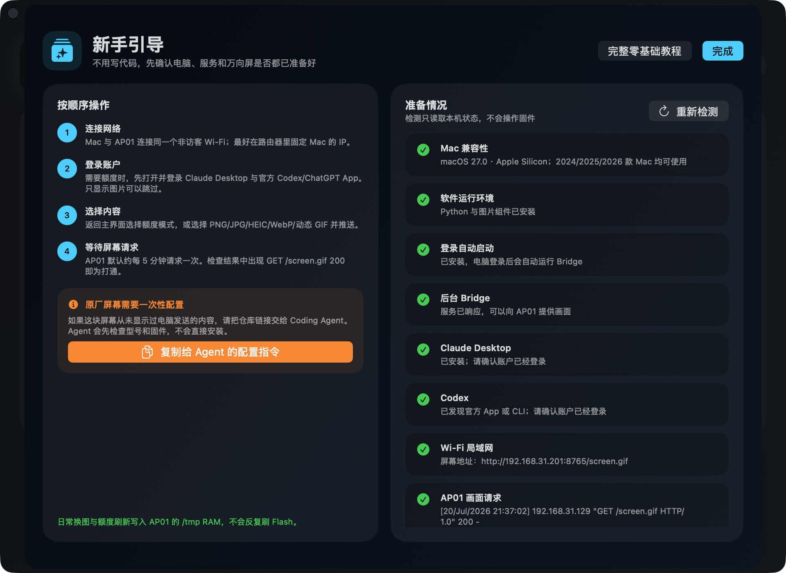

<div align="center">
  

  # CUKTECH Screen Controller

  **酷态科 AP01 万向屏的 macOS 控制器与 Coding Agent 自动配置工具。**

  自定义图片与 GIF · Claude/Codex 实时额度 · 局域网刷新 · RAM 更新

  [](#高级与手动配置)
  [](#首次配置实时固件)
  [](#屏幕协议)
  [](LICENSE)

  [零基础教程](docs/BEGINNER_GUIDE.zh-CN.md) · [安装 macOS 软件](#方法一安装-macos-软件) · [交给 Coding Agent 配置](#方法二把-github-仓库交给-coding-agent)

  [English](README.md) · [简体中文](README.zh-CN.md) · [图文教程](docs/xiaohongshu-tutorial.zh-CN.md) · [Skill](#coding-agent-与-skill)
</div>

---

## 选择一种使用方式

CUKTECH Screen Controller 提供两种使用方式。

> **完全没有编程基础？** 直接打开[零基础使用教程](docs/BEGINNER_GUIDE.zh-CN.md)。
> 它从下载安装、macOS 第一次打开，到检查 AP01 是否收到画面逐步讲解。

| | 方法一：安装 macOS 软件 | 方法二：交给 Coding Agent |
| --- | --- | --- |
| 适合人群 | 使用原生界面的日常用户 | 首次配置、故障诊断和深度自定义 |
| 操作方式 | CUKTECH Screen Controller | Claude Code、Codex、OpenCode、WorkBuddy 等 |
| 自定义图片 | 选择 PNG、JPG 或 GIF 后直接推送 | 使用仓库脚本转换、验证并部署 |
| 额度面板 | Claude 与 Codex 实时额度 | 可修改 UI 与增加其他数据源 |
| 首次加载器 | BFNP 预检与 OTA 票据交接 | 完整兼容性检查、构建和安装流程 |
| 日常刷新 | 通过 Wi-Fi 更新 AP01 内存 | 通过 Wi-Fi 更新 AP01 内存 |

## 方法一：安装 macOS 软件

从 [GitHub Releases](https://github.com/wqytommy666/cuktech-screen-controller/releases/latest)
下载最新版 **CUKTECH Screen Controller**，解压后双击
**`Install CUKTECH Screen Controller.command`**。安装程序会创建独立运行环境，
把软件安装到 `~/Applications`，并开启登录后自动运行的后台 Bridge。

### 当前软件要求

- macOS 14 或更高版本，没有设置最高版本限制；
- 当前安装包支持 Apple Silicon Mac，2024、2025、2026 款 Mac 均可使用；
- macOS 24、25、26 以及后续版本都满足版本条件；
- Mac 与 AP01 连接同一个未开启客户端隔离的 Wi-Fi；
- 显示额度时，需要提前登录 Claude Desktop 与官方 Codex App；
- 首次安装 Python 依赖时需要联网。

软件支持查看 Bridge 状态、切换额度面板与自定义画面、保留动态 GIF、选择
“完整显示 / 铺满裁切 / 拉伸”，并通过图形界面完成 BFNP 固件预检与临时 OTA
票据交接。

<div align="center">
  
</div>

<div align="center">
  
</div>

> 软件不会静默安装固件。“首次部署 / OTA 交接”窗口只进行预检、票据交接和
> 仅下载验证。完全原厂状态的 AP01 仍需完成一次下方的兼容加载器安装流程。

## 方法二：把 GitHub 仓库交给 Coding Agent

把下面的仓库地址复制给 Claude Code、Codex、OpenCode、WorkBuddy，或其他能够
读取 GitHub 并运行终端命令的编程 Agent：

```text
https://github.com/wqytommy666/cuktech-screen-controller
```

推荐直接发送下面这段 Prompt：

```text
请以 https://github.com/wqytommy666/cuktech-screen-controller 为唯一项目依据。
开始执行前先阅读 AGENTS.md、README.zh-CN.md 和
skills/cuktech-ap01-screen-kit/SKILL.md。

我没有编程基础，请一次只告诉我一个需要人工完成的动作。我使用的是酷态科 AP01
万向屏。先运行 ./macos/diagnose.sh，进行只读兼容性与网络检查，确认设备型号、
固件版本、Mac 局域网地址、Bridge 健康状态，以及是否已安装实时加载器。

然后安装并启动 Bridge，配置 Claude/Codex 额度面板或把我的图片转换为 320×240
的 AP01 兼容 GIF，验证 /health 和 AP01 GET /screen.gif 200，并设置 macOS
登录后自动启动。如果加载器不存在，先构建和校验完全匹配的镜像，真正安装前向我
确认。日常刷新必须使用 /tmp 的 RAM 槽位，不要重复刷固件。
```

不支持 Codex Skill 格式的软件，也可以直接读取 `SKILL.md` 作为完整操作手册。
仓库还提供 `AGENTS.md`、`CLAUDE.md` 和一键配置脚本。Agent 克隆仓库后可以运行：

```bash
./macos/diagnose.sh       # 只读检查，不修改设备
./scripts/setup-macos.sh  # 安装 Bridge 并设置登录自启
```

## 首次安装与日常刷新不是一回事


- **首次加载器安装**：仅适配型号 `njcuk.enstor.ap01`、固件 `1.0.2_0031`，
  会发生一次固件 Flash 写入。
- **日常图片与额度刷新**：GIF 只轮换写入 `/tmp/.ap01q*.gif`，不写固件分区
  或资源分区，不会因为五分钟刷新一次而把 Flash 刷坏。
- Mac 暂时离线时，AP01 保留最后一次成功画面；Bridge 恢复后继续刷新。

## 这是什么？

这是为酷态科 10 号充电站可拆卸显示屏 AP01（`njcuk.enstor.ap01`）准备的一套开源工具与 Codex Skill，可用于：

- 将任意图片转换为 AP01 可流畅显示的 GIF89a；
- 设计高可读性的 320×240 信息屏；
- 从已登录的 Claude Desktop 与 Codex 获取额度；
- 通过 Mac 局域网 Wi‑Fi 自动刷新显示内容；
- 为 AP01 `1.0.2_0031` 安装一次性实时加载器；
- 此后不再刷固件，只替换本地 GIF 即可换内容。

额度面板只是一个示例。你可以替换为艺术图、日历、天气、充电功率、构建状态、Home Assistant 指标或任何你喜欢的信息。

## 核心能力

| 自定义内容 | Claude / Codex 面板 | 轻量运行时 |
| --- | --- | --- |
| 将图片转换为经过校验的 320×240 GIF89a。 | Claude 5 小时 / 本周 / Fable 5；Codex 5 小时 / 本周。 | 帧数受控的动画，通常低于 90 KB。 |
| 支持 `contain`、`cover`、`stretch`。 | 深色 OLED 风格、官方图标、重置时间与中文标签。 | AP01 在 `/tmp` RAM 中轮换文件，不写资源分区。 |

## 工作架构


首次固件安装只负责加入加载器。此后的画面更新均通过 Wi‑Fi 下载并写入 RAM。

## 高级与手动配置

### 1. 建立环境

```bash
git clone https://github.com/wqytommy666/cuktech-screen-controller.git
cd cuktech-screen-controller
python3 -m venv .venv
.venv/bin/python -m pip install -r requirements.txt
```

### 2. 把任意图片变成 AP01 屏幕

```bash
.venv/bin/python ap01_prepare_screen.py ./my-artwork.png artifacts/screen.gif \
  --fit contain --background '#01040B'
.venv/bin/python ap01_screen_bridge.py artifacts/screen.gif --port 8765
```

转换器会输出 320×240 GIF89a：静态图会生成稳定的双帧容器，动态 GIF 会在限制
帧数与体积的同时保留可见动画。之后只需要原子替换 `artifacts/screen.gif`，
AP01 会在下一次刷新时获取新内容。

### 3. 运行 Claude + Codex 额度面板

在运行 Bridge 的 Mac 上登录 Claude Desktop 与 Codex，然后执行：

```bash
.venv/bin/python quota_dashboard.py
.venv/bin/python -u ap01_wifi_bridge.py --bind 0.0.0.0 --port 8765 --interval 300
```

在 `artifacts/quota-dashboard@2x.png` 查看设计预览。Bridge 提供：

```text
http://MAC_LAN_IP:8765/screen.gif
http://MAC_LAN_IP:8765/api/v1/quota
http://MAC_LAN_IP:8765/health
```

## 首次配置实时固件

内置二进制 Patch 仅适配 AP01 型号 `njcuk.enstor.ap01`、固件
**`1.0.2_0031`**。构建前让 Mac 与 AP01 连接到同一个未隔离局域网，并在路由器中固定 Mac 的 DHCP 地址。

```bash
# 通过已登录的米家账户确认并下载对应原厂固件。
.venv/bin/python mi_cloud.py firmware
.venv/bin/python mi_cloud.py download

# 构建带兜底画面的兼容镜像，并注入本地 HTTP 加载器。
.venv/bin/python ap01_custom_ota.py artifacts/screen.gif \
  --firmware artifacts/ap01-1.0.2_0031.bin \
  --output artifacts/ap01-1.0.2_0031-screen-compat.bin

.venv/bin/python ap01_realtime_patch.py \
  --input artifacts/ap01-1.0.2_0031-screen-compat.bin \
  --output artifacts/ap01-1.0.2_0031-screen-realtime.bin \
  --build-dir artifacts/realtime-build \
  --url http://MAC_LAN_IP:8765/screen.gif \
  --refresh-seconds 300

# 先验证下载链路，再安装已经构建好的镜像。
.venv/bin/python ap01_install_firmware.py \
  artifacts/ap01-1.0.2_0031-screen-realtime.bin --download-only
.venv/bin/python ap01_install_firmware.py \
  artifacts/ap01-1.0.2_0031-screen-realtime.bin --install
```

最终安装前先启动 Bridge。日志中出现
`AP01_IP "GET /screen.gif" 200`，即表示端到端实时刷新已打通。

### 小米 FDS 上传前提

AP01 自身没有小米云端的 FDS 上传配置。把 AP01 的 DID/model 传给
`/home/genpresignedurl`，会稳定返回 `code=-6`、`invalid config for fds`。
仓库原本的传输链路实际使用了两个不同的设备身份：

- 账号中的 `lumi.gateway.*` 或 `xiaomi.gateway.*` 网关只负责申请 FDS
  上传地址；
- AP01 的 DID 只在后续 `miIO.ota` 下载指令中作为目标设备。

因此不存在可以手工填写的 AP01 bucket、隐藏 model 或特殊 DID。如果 AP01
账号没有具备 FDS 配置的网关，可由可信的网关账号上传**完全相同的 BIN**，
再把短时有效的签名 URL 交给 AP01 账号执行下载验证。

在含网关的上传账号/Mac 上执行：

```bash
.venv/bin/python ap01_install_firmware.py \
  artifacts/screen-realtime.bin \
  --upload-only --url-output /tmp/ap01-ota-url.txt
```

如果自动识别不明确，可以补充该账号真实拥有且具备 FDS 配置的网关：
`--fds-did DID --fds-model lumi.gateway.MODEL`。随便填写 model 或使用 AP01
的 DID 都不能绕过服务端配置。

随后把 `/tmp/ap01-ota-url.txt` 发给 AP01 所属账号，在 URL 失效前执行：

```bash
.venv/bin/python ap01_install_firmware.py \
  artifacts/screen-realtime.bin \
  --download-only --ota-url-file /path/to/ap01-ota-url.txt --timeout 360
```

这条命令只验证 AP01 能否下载及校验 MD5，不会安装或切换启动分区。上传端和
下载端必须使用逐字节相同的 `screen-realtime.bin`，中间不要重新构建。

给自动化 Agent 使用的完整故障分流与验收清单见：
[AP01 无外置网关时的 FDS 解决方案](docs/AP01_FDS_NO_GATEWAY_SOLUTION.zh-CN.md)。

## 屏幕协议

| 要求 | 参数 |
| --- | --- |
| 物理分辨率 | 320×240 |
| 容器 | GIF89a |
| 动画 | 至少 2 帧；推荐慢速动画 |
| 推荐体积 | ≤ 90 KB |
| 固件槽位上限 | 221,445 bytes |
| 运行时加载器上限 | 256 KiB |
| 系统时间预留 | 保留第 0–39 行以显示原厂时钟/日期 |

## Flash 写入行为

固件安装会写入一次 Flash；普通内容与额度刷新不是这样。实时加载器只会写入以下 RAM 路径：

```text
/tmp/.ap01q0.gif
/tmp/.ap01q1.gif
/tmp/.ap01q2.gif
/tmp/.ap01q.meta
/tmp/.ap01q.ack
```

因此，修改画面或刷新额度时，**不会反复写入** AP01 固件与资源分区。

## 隐私

- Claude 与 Codex 数据来自本机已经登录的官方客户端账户。
- Session 凭据仅保留在内存中。
- 输出 JSON 只包含额度数据。
- 仓库不会上传固件、米家账号凭据、签名下载链接、设备 ID、局域网 IP 或运行产物。

## Coding Agent 与 Skill

仓库内包含可独立安装的 Codex Skill：

```bash
cp -R skills/cuktech-ap01-screen-kit ~/.codex/skills/
```

安装后可直接使用：

```text
Use $cuktech-ap01-screen-kit to turn this image into an AP01 screen.
Use $cuktech-ap01-screen-kit to design and deploy a Claude/Codex quota dashboard.
Use $cuktech-ap01-screen-kit to diagnose why AP01 is not refreshing.
```

Skill 内含可复用项目模板、图片转换器、额度面板、固件工作流与网络诊断说明。

## 目录结构

```text
ap01_prepare_screen.py     任意图片转 AP01 安全 GIF
ap01_screen_bridge.py      在局域网提供可替换画面
quota_dashboard.py         渲染 Claude + Codex 额度 UI
ap01_wifi_bridge.py        自动刷新并提供额度面板
ap01_realtime_patch.py     构建 1.0.2_0031 RAM 加载器
ap01_install_firmware.py   通过小米 OTA 下发已构建镜像
realtime_payload/          AP01 加载器源码
skills/                    可安装的 Codex Skill
macos/                     SwiftUI 软件、安装器与 Release 打包脚本
```

## 开发

```bash
.venv/bin/python -m unittest -v test_quota_dashboard.py test_ap01_install_firmware.py
.venv/bin/python ap01_prepare_screen.py docs/images/quota-dashboard-preview.png /tmp/ap01.gif
```

贡献规范见 [CONTRIBUTING.md](CONTRIBUTING.md)。项目采用 [MIT License](LICENSE)。
