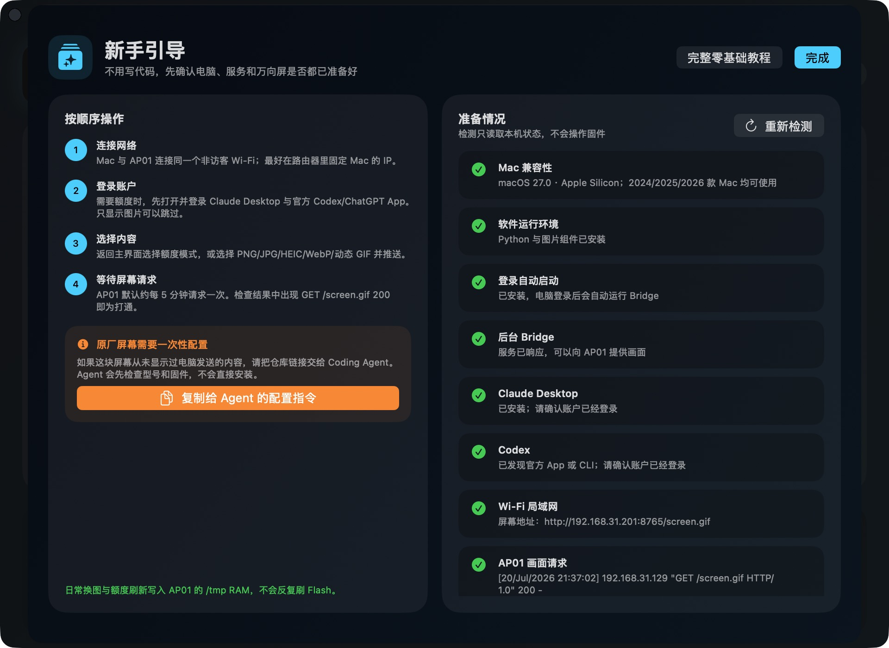

<div align="center">
  
  

  # CUKTECH Screen Controller

  **酷态科 AP01 万向屏的 macOS 与 Windows 图形控制器。**

  自定义图片与 GIF · Claude/Codex 实时额度 · 局域网刷新 · RAM 更新

  [](#高级与手动配置)
  [](#平台支持)
  [](#方法一安装图形软件)
  [](#首次配置实时固件)
  [](#屏幕协议)
  [](LICENSE)

  [平台支持](#平台支持) · [Windows 指南](docs/WINDOWS_GUIDE.zh-CN.md) · [安装前准备](docs/PREPARATION_CHECKLIST.zh-CN.md) · [零基础教程](docs/BEGINNER_GUIDE.zh-CN.md) · [安装图形软件](#方法一安装图形软件) · [交给 Coding Agent 配置](#方法二把-github-仓库交给-coding-agent)

  [English](README.md) · [简体中文](README.zh-CN.md) · [图文教程](docs/xiaohongshu-tutorial.zh-CN.md) · [Skill](#coding-agent-与-skill)
</div>

---

## 选择一种使用方式

### 新电脑 + 全新设备：交给 Codex / WorkBuddy

把仓库链接和这句话交给能操作本机终端的 Agent：

> 请克隆本仓库，阅读 `AGENTS.md` 和
> [`docs/agent-first-install.md`](docs/agent-first-install.md)，按新电脑首次配置流程
> 帮我完成环境、内容、登录自启、兼容性检查、仅下载验证和屏幕取图验收；安装固件前单独向我确认。

无需预装 Skill，也不需要作者的电脑或账号。**首次 Loader 仅支持 AP01 `0031`，
不是所有新购固件都支持。** Windows 首次 OTA 目前仍需本机米家凭据 JSON，
没有内置扫码登录；共享服务离线时首次部署也会受阻。上述指南会明确区分这些状态。

**源码运行时新增可选 Antigravity + Codex 面板：**读取官方 Antigravity 的
Gemini 与 Claude/GPT 两组额度，每组显示 5 小时及本周剩余量。不是 Gemini CLI
额度。详见[中英文接入说明](docs/ANTIGRAVITY_QUOTA.md)。

CUKTECH Screen Controller 提供两种使用方式。

> **完全没有编程基础？** 直接打开[零基础使用教程](docs/BEGINNER_GUIDE.zh-CN.md)。
> 它从下载安装、macOS 第一次打开，到检查 AP01 是否收到画面逐步讲解。

> **没有米家网关也可以。** 原厂 AP01 用户只需让屏幕稳定供电、在米家中在线，
> 并让电脑与屏幕处于同一局域网。软件中的“无网关：一键获取部署包”会通过受限
> 共享服务完成 FDS 上传；真正写入前仍会要求用户明确确认。

> [!CAUTION]
> **需要自定义屏幕的 `1.0.2_0031` 用户暂时不要升级 `1.0.2_0041`。** 已核验的
> `0041` 会拒绝当前未签名第三方 Loader，已知米家 OTA 路径也不能降级。
> FDS 中转或外置网关不能绕过这项签名校验。详见
> [AP01 固件兼容状态](docs/AP01_FIRMWARE_STATUS.zh-CN.md)。

> **2026-09-25 连接修复：** 共享部署入口已重新完成申请、下载与校验测试，
> 并加入持续健康检查。已有 Loader 的屏幕不更新时，请核对电脑 IP 和账号登录态；
> 不要为日常刷新重复安装固件。详见[修复记录与剩余限制](docs/CONNECTIVITY_REPAIR_2026-09-25.zh-CN.md)。

| | 方法一：安装 macOS / Windows 软件 | 方法二：在 macOS / Windows 交给 Coding Agent |
| --- | --- | --- |
| 适合人群 | 使用原生界面的日常用户 | 首次配置、故障诊断和深度自定义 |
| 操作方式 | CUKTECH Screen Controller 图形软件 | Claude Code、Codex、OpenCode、WorkBuddy 等 |
| 自定义图片 | 选择 PNG、JPG 或 GIF 后直接推送 | 使用仓库脚本转换、验证并部署 |
| 额度面板 | 两个平台均可显示 Claude 与 Codex 实时额度 | 可修改 UI，并使用同一套账号采集器 |
| 首次加载器 | 无网关一键准备、BFNP 预检与确认安装 | 完整兼容性检查、构建和安装流程 |
| 日常刷新 | 通过 Wi-Fi 更新 AP01 内存 | 通过 Wi-Fi 更新 AP01 内存 |

## 平台支持

完整日常流程已经支持两个平台：

- **macOS：** Apple Silicon 原生 SwiftUI 软件，要求 macOS 14 或更高版本；
- **Windows：** Windows 10/11 x64 图形软件；
- 两个平台都支持画面预览、自定义图片/GIF、Claude/Codex 额度、Bridge 状态、
  登录自动启动、新手检查与无网关 OTA 部署；
- **Python 脚本与 Coding Agent 工具链**也同时支持 macOS 和 Windows，可用于
  图片转换、验证、诊断和深度自定义；
- Windows 使用 `scripts/setup-windows.ps1` 与 `scripts/diagnose-windows.ps1`，
  macOS 使用 `macos/` 目录中的脚本。

完整步骤见：[Windows 使用指南](docs/WINDOWS_GUIDE.zh-CN.md)。

## 方法一：安装图形软件

从 [GitHub Releases](https://github.com/wqytommy666/cuktech-screen-controller/releases/latest)
下载最新版 **CUKTECH Screen Controller**：

- **Windows 10/11 x64：**解压
  `CUKTECH-Screen-Controller-0.4.1-Windows-x64.zip`，双击
  **`Install CUKTECH Screen Controller.cmd`**。详见
  [Windows 使用指南](docs/WINDOWS_GUIDE.zh-CN.md)；
- **Apple Silicon macOS：**解压
  `CUKTECH-Screen-Controller-v0.4.1-macOS-arm64.zip`，双击
  **`Install CUKTECH Screen Controller.command`**。

两个安装器都会开启登录后自动运行的后台 Bridge。Windows 包自带完整运行环境；
macOS 安装器会在第一次运行时创建隔离 Python 环境。

### 当前要求

- Apple Silicon macOS 14+，或 Windows 10/11 x64；
- 电脑与 AP01 位于同一个未开启客户端隔离的局域网；
- 显示额度时，需要提前登录 Claude Desktop 与官方 Codex App；
- 实时额度与首次 OTA 云端操作需要互联网。
- **用户不需要购买小米网关**；共享 FDS 服务只在原厂屏首次安装时使用一次。

### 联网和设备准备（务必先看）

> [!IMPORTANT]
> **首次安装加载器前，必须先固定运行 Bridge 的电脑 IP。** AP01 固件保存的是
> `http://电脑IP:8765/screen.gif` 这个固定地址，不会跟随 DHCP 自动变化。优先在
> 路由器中设置 DHCP 静态分配；如果地址后来变化，先恢复原地址（不写 Flash）。只有
> 原地址无法恢复时，才固定新地址并重新生成、安装加载器（再写一次 Flash）。详细步骤：
> [Bridge 固定 IP 与地址变更恢复指南](docs/STABLE_IP_GUIDE.zh-CN.md)。

| 使用场景 | AP01 / 充电站 | 运行软件的电脑 | 是否需要互联网 |
| --- | --- | --- | --- |
| 已改造屏幕，显示本地图片 | 保持供电并连接家庭局域网 | 与 AP01 同一局域网，Bridge 运行 | 不需要；局域网正常即可 |
| 显示 Claude / Codex 额度 | 保持供电并连接家庭局域网 | 同一局域网，官方客户端已登录 | **电脑需要**，用于读取最新额度 |
| 完全原厂屏首次安装加载器 | 在米家完成配网并显示在线，安装期间稳定供电 | 能访问互联网和同一局域网 | **AP01 与电脑都需要** |

- 本项目日常通过 **Wi-Fi/LAN** 传图，不通过 USB 或底座触点传输显示内容；
- 不能使用访客网络，并应关闭路由器的 AP/客户端隔离；电脑使用网线也可以，
  只要和 AP01 处于能够互相访问的同一局域网；
- 如果 macOS 或 Windows 询问是否允许接收网络连接，请选择“允许”；VPN/代理需要允许访问
  本地局域网和 TCP `8765` 端口；
- 首次加载器安装前，需要准备 AP01 所属的米家账号并确认型号
  `njcuk.enstor.ap01`、固件 `1.0.2_0031`。不要拔电、重置或让设备离线；
- 实时画面依赖电脑保持开机、用户已登录且 Bridge 正在运行。电脑睡眠或关机时，
  额度面板约 7 分钟后显示“未连接，请连接”；用户主动选择的静态/自定义画面保持不变；
- **首次安装加载器前必须**在路由器中为电脑设置 DHCP 地址保留。macOS 使用私有
  Wi-Fi 地址时应保持“固定”而不是“轮换”，并以路由器显示的当前 MAC 为准；
- 如果路由器无法设置地址保留，必须先明确告知用户：地址变化后应优先恢复旧 IP；
  无法恢复时需要为新 IP 重新构建并安装一次加载器。不要在地址未稳定时反复刷写。

完整清单请看：[安装前准备与联网说明](docs/PREPARATION_CHECKLIST.zh-CN.md)。

软件支持查看 Bridge 状态、切换额度面板与自定义画面、保留动态 GIF、选择
“完整显示 / 铺满裁切 / 拉伸”，并通过图形界面自动获取无网关部署包、完成
BFNP 固件预检、仅下载验证与确认安装。

<div align="center">
  
</div>

<div align="center">
  
</div>

> 软件不会静默安装固件。它会先进行米家只读检查、获取部署包和仅下载验证，
> 最后单独弹出 Flash 写入确认。完全原厂状态的 AP01 只需完成这一次安装。

## 方法二：把 GitHub 仓库交给 Coding Agent

把下面的仓库地址复制给 Claude Code、Codex、OpenCode、WorkBuddy，或其他能够
读取 GitHub 并运行终端命令的编程 Agent：

```text
https://github.com/wqytommy666/cuktech-screen-controller
```

推荐直接发送下面这段 Prompt：

```text
请以 https://github.com/wqytommy666/cuktech-screen-controller 为唯一项目依据。
开始执行前先阅读 AGENTS.md、docs/agent-first-install.md、README.zh-CN.md 和
skills/cuktech-ap01-screen-kit/SKILL.md。

我没有编程基础，请一次只告诉我一个需要人工完成的动作。我使用的是酷态科 AP01
万向屏。先检测当前是 macOS 还是 Windows。macOS 运行 ./macos/diagnose.sh；
Windows 先阅读 docs/WINDOWS_GUIDE.zh-CN.md，再运行
powershell -ExecutionPolicy Bypass -File scripts/diagnose-windows.ps1。进行只读兼容性
与网络检查，确认电脑局域网地址、Bridge 健康状态，以及是否已安装实时加载器。

在任何首次加载器构建前，先从路由器设备列表确认 Bridge 电脑的当前 IP 和 MAC，
完成 DHCP 静态地址保留，并在重连后验证地址不变。若路由器不支持地址保留，必须先
向我解释：AP01 固件保存固定 IP，今后 IP 变化时需要恢复旧地址；旧地址无法恢复时
需要固定新地址并重新构建、确认安装一次固件。

然后安装并启动 Bridge，配置 Claude/Codex、Antigravity/Codex 额度或我的自定义图片。验证 /health 和
AP01 GET /screen.gif 200，并按当前操作系统
设置登录后自动启动。如果加载器不存在，先构建和校验完全匹配的镜像，真正安装前
向我确认。日常刷新必须使用 /tmp 的 RAM 槽位，不要重复刷固件。
```

不支持 Codex Skill 格式的软件，也可以直接读取 `SKILL.md` 作为完整操作手册。
仓库还提供 `AGENTS.md`、`CLAUDE.md` 和跨平台配置脚本。Agent 克隆后按系统运行：

```bash
./macos/diagnose.sh       # 只读检查，不修改设备
./scripts/setup-macos.sh  # 安装 Bridge 并设置登录自启

# Windows PowerShell
.\scripts\diagnose-windows.ps1
.\scripts\setup-windows.ps1 -InputImage "C:\Pictures\screen.png"
```

## 首次安装与日常刷新不是一回事


```mermaid
flowchart LR
  A["原厂 AP01"] -->|"仅首次：安装实时加载器"| B["写入一次 Flash"]
  B --> C["已经具备实时显示能力"]
  C -->|"日常：获取 screen.gif"| D["写入 /tmp RAM 槽位"]
  D --> E["更新画面，不重复刷固件"]
```

- **首次加载器安装**：仅适配型号 `njcuk.enstor.ap01`、固件 `1.0.2_0031`，
  会发生一次固件 Flash 写入。
- **日常图片与额度刷新**：GIF 只轮换写入 `/tmp/.ap01q*.gif`，不写固件分区
  或资源分区，不会因为五分钟刷新一次而把 Flash 刷坏。
- 运行 Bridge 的电脑暂时离线时，AP01 最多保留当前面板约 7 分钟，随后显示
  “未连接，请连接”；Bridge 恢复后继续刷新。

### 如何判断屏幕上的额度是不是最新的

- 软件每 5 分钟重新读取 Claude/Codex 官方本机登录态；
- 在线卡片的计划徽章带绿色状态点和最后成功刷新时间，可与屏幕顶部时钟直接比较；
- 采集失败时，Bridge 不再保留旧数字，而是发送大字“未连接 / 请连接”状态页；
- 即使电脑直接关机、AP01 完全访问不到 Bridge，已下发的实时 GIF 也会在约 7 分钟后
  自动停在“未连接，请连接”，不会把上一张额度图永久伪装成实时数据；
- 连接恢复并成功刷新后，下一次 AP01 轮询会自动恢复最新额度面板。

## 这是什么？

这是为酷态科 10 号充电站可拆卸显示屏 AP01（`njcuk.enstor.ap01`）准备的一套 macOS/Windows 图形软件、开源工具与 Codex Skill，可用于：

- 将任意图片转换为 AP01 可流畅显示的 GIF89a；
- 设计高可读性的 320×240 信息屏；
- 从已登录的 Claude Desktop 与 Codex 获取额度；
- 通过 macOS 或 Windows 电脑的局域网 Wi‑Fi 自动刷新显示内容；
- 为 AP01 `1.0.2_0031` 安装一次性实时加载器；
- 此后不再刷固件，只替换本地 GIF 即可换内容。

额度面板只是一个示例。你可以替换为艺术图、日历、天气、充电功率、构建状态、Home Assistant 指标或任何你喜欢的信息。

## 核心能力

| 自定义内容 | Claude / Codex 面板 | 轻量运行时 |
| --- | --- | --- |
| 将图片转换为经过校验的 320×240 GIF89a。 | Claude 5 小时 / 本周 / Fable 5；Codex 5 小时 / 本周。 | 帧数受控的动画，通常低于 90 KB。 |
| 支持 `contain`、`cover`、`stretch`。 | 深色 OLED 风格、官方图标、重置时间与中文标签。 | AP01 在 `/tmp` RAM 中轮换文件，不写资源分区。 |

## 工作架构


```mermaid
flowchart LR
  A["自定义画面或数据"] --> B["macOS / Windows 渲染器与 Bridge"]
  B -->|"GIF89a · 320×240 · HTTP"| C["AP01 实时加载器"]
  C --> D["/tmp/.ap01q0.gif\n/tmp/.ap01q1.gif\n/tmp/.ap01q2.gif"]
  D --> E["LVGL 虚拟形象页面"]
```

首次固件安装只负责加入加载器。此后的画面更新均通过 Wi‑Fi 下载并写入 RAM。

## 高级与手动配置

### 1. 建立环境

```bash
git clone https://github.com/wqytommy666/cuktech-screen-controller.git
cd cuktech-screen-controller
python3 -m venv .venv
.venv/bin/python -m pip install -r requirements.txt
```

Windows PowerShell 使用：

```powershell
py -3 -m venv .venv
.\.venv\Scripts\python.exe -m pip install -r requirements.txt
```

### 2. 把任意图片变成 AP01 屏幕

```bash
.venv/bin/python ap01_prepare_screen.py ./my-artwork.png artifacts/screen.gif \
  --fit contain --background '#01040B'
.venv/bin/python ap01_screen_bridge.py artifacts/screen.gif --port 8765
```

转换器会输出 320×240 GIF89a：静态图会生成稳定的双帧容器，动态 GIF 会在限制
帧数与体积的同时保留可见动画。之后只需要原子替换 `artifacts/screen.gif`，
AP01 会在下一次刷新时获取新内容。

### 3. 运行 Claude + Codex 额度面板

在运行 Bridge 的电脑上登录 Claude Desktop 与 Codex，然后执行：

```bash
.venv/bin/python quota_dashboard.py
.venv/bin/python -u ap01_wifi_bridge.py --bind 0.0.0.0 --port 8765 --interval 300
```

在 `artifacts/quota-dashboard@2x.png` 查看设计预览。Bridge 提供：

```text
http://COMPUTER_LAN_IP:8765/screen.gif
http://COMPUTER_LAN_IP:8765/api/v1/quota
http://COMPUTER_LAN_IP:8765/health
```

自动账号读取支持两个平台：macOS 通过 Keychain 读取 Claude Safe Storage；
Windows 使用 DPAPI 在内存中解密当前用户的 Claude Electron 登录态；Codex 在
两个平台都通过本地 `app-server` 获取额度。

## 首次配置实时固件

普通用户优先按[首次配置指南第 6、7 节](docs/agent-first-install.md#6-获取首次部署包普通用户优先共享-relay)
获取受限共享部署包，不需要本地编译器或自己的网关。**下面是高级本地构建路径**；
不要直接下载云端“最新”固件并套用 0031 的补丁，先验证确切版本和固定的原厂 hash。

内置二进制 Patch 仅适配 AP01 型号 `njcuk.enstor.ap01`、固件
**`1.0.2_0031`**。构建前让运行 Bridge 的电脑与 AP01 连接到同一个未隔离
局域网，并在路由器中固定这台电脑的 DHCP 地址。

不要把“固定地址”当成可选优化。加载器写入的是字面量 IPv4 URL；构建前请先按照
[固定 IP 指南](docs/STABLE_IP_GUIDE.zh-CN.md)完成路由器 DHCP 保留并重连验证。

```bash
# 通过已登录的米家账户确认并下载对应原厂固件。
.venv/bin/python mi_cloud.py firmware
.venv/bin/python mi_cloud.py download

# 构建带兜底画面的兼容镜像，并注入本地 HTTP 加载器。
.venv/bin/python ap01_custom_ota.py artifacts/screen.gif \
  --firmware artifacts/ap01-1.0.2_0031.bin \
  --output artifacts/ap01-1.0.2_0031-screen-compat.bin

.venv/bin/python ap01_realtime_patch.py \
  --input artifacts/ap01-1.0.2_0031-screen-compat.bin \
  --output artifacts/ap01-1.0.2_0031-screen-realtime.bin \
  --build-dir artifacts/realtime-build \
  --url http://COMPUTER_LAN_IP:8765/screen.gif \
  --refresh-seconds 300

# 先验证下载链路，再安装已经构建好的镜像。
.venv/bin/python ap01_install_firmware.py \
  artifacts/ap01-1.0.2_0031-screen-realtime.bin --download-only
.venv/bin/python ap01_install_firmware.py \
  artifacts/ap01-1.0.2_0031-screen-realtime.bin --install
```

最终安装前先启动 Bridge。日志中出现
`AP01_IP "GET /screen.gif" 200`，即表示端到端实时刷新已打通。

### 小米 FDS 上传前提

#### 普通用户：不需要拥有网关

CUKTECH Screen Controller 0.4 起提供受限的共享 FDS 票据服务。软件只会发送
电脑的私有局域网 Bridge 地址、刷新间隔、目标型号和固件版本；用户的米家账号、
密码、Token、AP01 DID、Claude/Codex 登录态都不会发送给共享服务。服务端不接受
任意 BIN，只能从 SHA-256 固定的 `1.0.2_0031` 原厂镜像构建经过审查的实时加载器。

图形软件操作顺序：

1. 点击“无网关：一键获取部署包”；
2. 软件确认 AP01 为 `njcuk.enstor.ap01 / 1.0.2_0031` 且米家在线；
3. 下载并核对 BFNP、大小、SHA-256 与 MD5；
4. 点击“仅下载验证（不会安装）”；
5. 验证成功后点击“确认后安装”，并在最终弹窗中明确确认。

共享服务仅解决一次性的 FDS 上传，最终 `miIO.ota` 仍由用户本机登录的米家账号
发给用户自己的 AP01。安装成功后，日常画面全部走局域网 `/tmp` RAM，不依赖
共享服务或任何网关。服务协议和自建说明见
[共享 FDS 服务运维文档](docs/FDS_RELAY_OPERATOR.zh-CN.md)。

#### 高级用户：自己的网关或手动票据

AP01 自身没有小米云端的 FDS 上传配置。把 AP01 的 DID/model 传给
`/home/genpresignedurl`，会稳定返回 `code=-6`、`invalid config for fds`。
仓库原本的传输链路实际使用了两个不同的设备身份：

- 账号中的 `lumi.gateway.*` 或 `xiaomi.gateway.*` 网关只负责申请 FDS
  上传地址；
- AP01 的 DID 只在后续 `miIO.ota` 下载指令中作为目标设备。

因此不存在可以手工填写的 AP01 bucket、隐藏 model 或特殊 DID。如果 AP01
账号没有具备 FDS 配置的网关，可由可信的网关账号上传**完全相同的 BIN**，
再把短时有效的签名 URL 交给 AP01 账号执行下载验证。

在含网关的上传账号/Mac 上执行：

```bash
.venv/bin/python ap01_install_firmware.py \
  artifacts/screen-realtime.bin \
  --upload-only --url-output /tmp/ap01-ota-url.txt
```

如果自动识别不明确，可以补充该账号真实拥有且具备 FDS 配置的网关：
`--fds-did DID --fds-model lumi.gateway.MODEL`。随便填写 model 或使用 AP01
的 DID 都不能绕过服务端配置。

随后把 `/tmp/ap01-ota-url.txt` 发给 AP01 所属账号，在 URL 失效前执行：

```bash
.venv/bin/python ap01_install_firmware.py \
  artifacts/screen-realtime.bin \
  --download-only --ota-url-file /path/to/ap01-ota-url.txt --timeout 360
```

这条命令只验证 AP01 能否下载及校验 MD5，不会安装或切换启动分区。上传端和
下载端必须使用逐字节相同的 `screen-realtime.bin`，中间不要重新构建。

给自动化 Agent 使用的完整故障分流与验收清单见：
[AP01 无外置网关时的 FDS 解决方案](docs/AP01_FDS_NO_GATEWAY_SOLUTION.zh-CN.md)。

## 屏幕协议

| 要求 | 参数 |
| --- | --- |
| 物理分辨率 | 320×240 |
| 容器 | GIF89a |
| 动画 | 至少 2 帧；推荐慢速动画 |
| 推荐体积 | ≤ 90 KB |
| 固件槽位上限 | 221,445 bytes |
| 运行时加载器上限 | 256 KiB |
| 系统时间预留 | 保留第 0–39 行以显示原厂时钟/日期 |

## Flash 写入行为

固件安装会写入一次 Flash；普通内容与额度刷新不是这样。实时加载器只会写入以下 RAM 路径：

```text
/tmp/.ap01q0.gif
/tmp/.ap01q1.gif
/tmp/.ap01q2.gif
/tmp/.ap01q.meta
/tmp/.ap01q.ack
```

因此，修改画面或刷新额度时，**不会反复写入** AP01 固件与资源分区。

## 隐私

- Claude 与 Codex 数据来自本机 macOS 或 Windows 用户已经登录的官方客户端账户。
- Session 凭据仅保留在内存中。
- 输出 JSON 只包含额度数据。
- 仓库不会上传固件、米家账号凭据、签名下载链接、设备 ID、局域网 IP 或运行产物。

## Coding Agent 与 Skill

仓库内包含可独立安装的 Codex Skill：

```bash
cp -R skills/cuktech-ap01-screen-kit ~/.codex/skills/
```

安装后可直接使用：

```text
Use $cuktech-ap01-screen-kit to turn this image into an AP01 screen.
Use $cuktech-ap01-screen-kit to design and deploy a Claude/Codex quota dashboard.
Use $cuktech-ap01-screen-kit to diagnose why AP01 is not refreshing.
```

Skill 内含可复用项目模板、图片转换器、额度面板、固件工作流与网络诊断说明。

## 目录结构

```text
ap01_prepare_screen.py     任意图片转 AP01 安全 GIF
ap01_screen_bridge.py      在局域网提供可替换画面
quota_dashboard.py         渲染 Claude + Codex 额度 UI
ap01_wifi_bridge.py        自动刷新并提供额度面板
ap01_realtime_patch.py     构建 1.0.2_0031 RAM 加载器
ap01_install_firmware.py   通过小米 OTA 下发已构建镜像
realtime_payload/          AP01 加载器源码
skills/                    可安装的 Codex Skill
macos/                     SwiftUI 软件、安装器与 Release 打包脚本
windows/                   Windows 图形软件、运行时、安装器与打包脚本
scripts/*windows.ps1       Windows 源码环境配置与只读诊断
```

## 开发

```bash
.venv/bin/python -m unittest -v test_quota_dashboard.py test_ap01_install_firmware.py test_platform_support.py test_windows_runtime.py
.venv/bin/python ap01_prepare_screen.py docs/images/quota-dashboard-preview.png /tmp/ap01.gif
```

贡献规范见 [CONTRIBUTING.md](CONTRIBUTING.md)。项目采用 [MIT License](LICENSE)。
