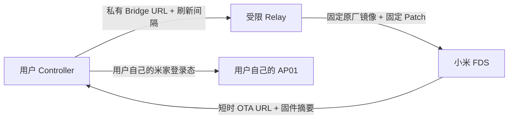

# CUKTECH AP01 共享 FDS 服务

这项服务让**没有米家网关**的 AP01 用户完成一次性实时加载器安装。它不是日常
画面服务器：加载器安装后，AP01 直接从用户电脑的局域网 Bridge 获取
`/screen.gif`，后续不再访问共享 FDS 服务。

## 用户最终需要什么

- 酷态科 AP01 万向屏与稳定供电；
- AP01 已绑定到用户自己的米家账号并显示在线；
- 电脑与 AP01 位于同一非隔离局域网；
- AP01 型号/固件严格为 `njcuk.enstor.ap01 / 1.0.2_0031`；
- CUKTECH Screen Controller。

用户不需要购买网关、准备 BIN、使用 USB 数据线或执行命令。软件会先完成只读
检查和仅下载验证，真正写入 Flash 前再次要求明确确认。

## 信任边界



Relay **不会收到**用户的米家账号、密码、Token、AP01 DID/MAC、家庭信息、
Claude/Codex 登录态或任意固件上传。它只接受以下白名单字段：

```json
{
  "api_version": 1,
  "model": "njcuk.enstor.ap01",
  "firmware": "1.0.2_0031",
  "bridge_url": "http://192.168.1.20:8765/screen.gif",
  "refresh_seconds": 300
}
```

`bridge_url` 必须是私有 IPv4、TCP `8765`、固定路径 `/screen.gif`，且满足 AP01
固件 40 字节 URL 槽位。刷新间隔限制为 60–1800 秒。

## 服务端安全约束

- 原厂镜像 SHA-256 固定为
  `8a721fc8ef25458d415b2460e4a251e0503a82f7743fdff85b12612190e5c1cb`；
- 不提供任意文件上传接口；
- 每次构建执行 Recovery CRC、允许修改范围、Payload 回读、无重定位等现有校验；
- 返回前固定 OTA 主机为 `iot-ota-cdn.io.mi.com`；
- 客户端重新校验 BFNP、文件长度、SHA-256 与 MD5；
- 签名 URL 不写普通日志，票据文件权限在支持的平台设为 `0600`；
- 默认每个来源每小时 3 次、全局每天 40 次，构建和上传串行执行；
- Relay 只绑定 `127.0.0.1`，公开入口应放在 Cloudflare Tunnel 或同等 HTTPS
  反向代理之后。

## 运行 Relay

服务端需要：已登录一个拥有真实 `lumi.gateway.*` 或 `xiaomi.gateway.*` 的米家
账号；私下保存的、哈希完全匹配的 AP01 `1.0.2_0031` 原厂 BIN；Python 依赖与
`riscv64-elf-gcc/binutils`。不得把凭据、DID、BIN 或签名 URL 提交到 GitHub。

```bash
python3 ap01_fds_relay_server.py \
  --stock-firmware /private/path/ap01-1.0.2_0031.bin \
  --cache-dir "$HOME/Library/Caches/CUKTECH Screen Controller/fds-relay" \
  --bind 127.0.0.1 --port 8790 --trust-proxy
```

账号中存在多个网关时，可以通过只保存在服务端的环境变量指定：

```bash
export CUKTECH_FDS_RELAY_GATEWAY_DID='真实网关 DID'
export CUKTECH_FDS_RELAY_GATEWAY_MODEL='lumi.gateway.真实型号'
```

健康检查：

```bash
curl --noproxy '*' http://127.0.0.1:8790/health
```

仓库维护者在 macOS 上也可以安装登录自启的 Relay、Quick Tunnel 和自动 discovery
更新（脚本只保存本地路径，不会复制米家凭据或固件进仓库）：

```bash
./macos/install-public-fds-relay-owner.sh /private/path/ap01-1.0.2_0031.bin
```

公开 HTTPS 地址写入发布维护者的 Relay discovery JSON（仓库中的
`relay-service.json` 是格式示例；官方客户端当前从维护者公开 Gist 读取）：

```json
{
  "enabled": true,
  "url": "https://relay.example.com",
  "api_version": 1
}
```

客户端从该文件发现服务。维护期间设置 `enabled: false`，客户端会明确显示维护状态，
不会回退到不安全的任意 OTA 地址。

## 本地客户端验证

开发环境可以临时允许 localhost HTTP；该开关不得作为公开发行配置：

```bash
CUKTECH_FDS_RELAY_ALLOW_HTTP=1 python3 ap01_fds_relay_client.py \
  --relay-url http://127.0.0.1:8790 \
  --bridge-url http://192.168.1.20:8765/screen.gif \
  --output artifacts/ap01-gateway-free-realtime.bin \
  --url-output artifacts/ap01-ota-url.txt \
  --skip-device-check
```

正式图形软件不使用 `--skip-device-check`：它必须先从用户本机米家登录态确认 AP01
型号、固件与在线状态。Relay 只负责生成 FDS 票据；最终安装仍由用户自己的账号
下发，并且必须经过最终确认。

## 故障分流

- `共享部署服务正在维护`：发现文件未启用或公开入口下线；
- `申请过于频繁`：等待 `Retry-After`，不要绕过限流；
- `服务端构建或上传失败`：检查服务端米家登录态、网关、RISC-V 工具链和 FDS
  限流；日志不会包含签名参数；
- `固件摘要不一致`：立即停用 Relay，清理缓存并重新检查固定原厂镜像与 Patch；
- AP01 固件不是 `1.0.2_0031`：停止，不得强制套用当前偏移。
